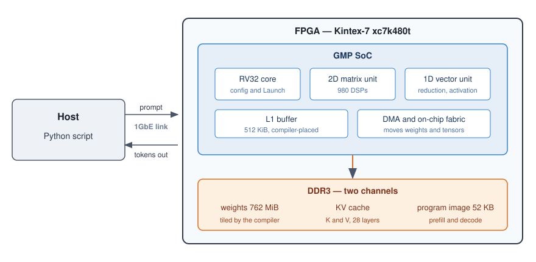
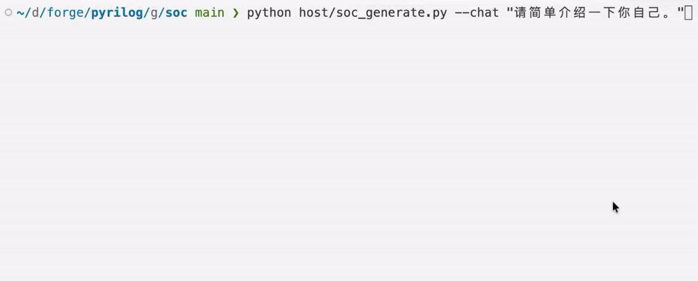
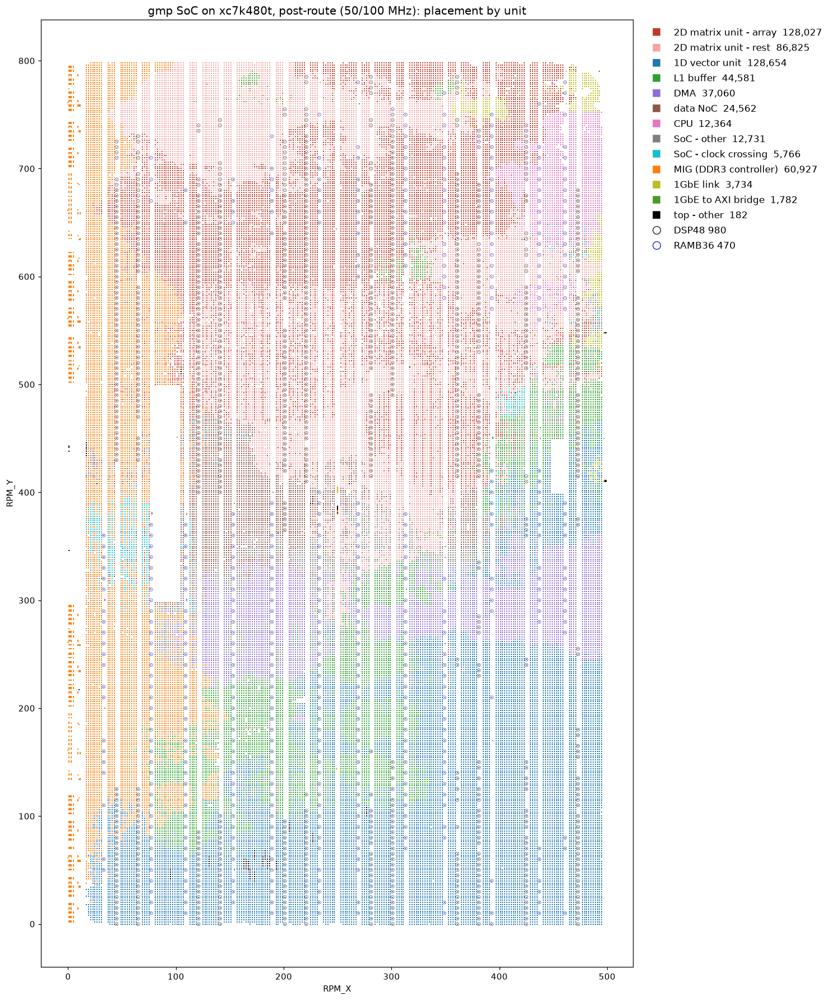
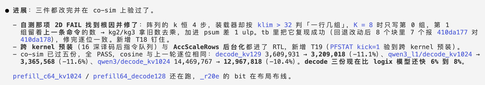

# Building an End-to-End Inference Chip with AI Agents

[中文](README.md)

This package ships the compiled artifacts and host tools for an end-to-end inference chip. Every
layer of the chip, from the software stack down to the netlist, was implemented by AI agents; no
human wrote a line of it. One month of intensive development, three repositories, 541 commits.

This page covers what the chip is, what the board has done, how the architecture was traded off,
how development was organized, what tooling it rests on, what ships in the package, and which
document to read next.

## What this is

GMP is an in-house neural-network accelerator, synthesized onto a single Kintex-7
(xc7k480t), with the weights of Qwen3 0.6B sitting in DDR3. The host sends a piece of text in
over the host interface; the chip runs all 28 layers token by token on its own, with the host
computing none of them, and hands the generated text back for the host to print.

The operator sequence for the whole network is compiled ahead of time into a program that lives
in DRAM. The chip follows that program once it starts; the host only feeds the prompt and picks
up the result. The bulk of the RTL is not written as Verilog at all: it is written in Pyrilog,
which describes hardware in Python and emits Verilog deterministically.

Development spanned the model compiler, the reference implementations of the operators, a
cycle-accurate C++ model, the RTL, the netlist and bitstream produced by synthesis, and the
host-side driver.



## What the board has done

A recording of one run on the board:



The line-by-line terminal transcript is in [`docs/usage.md`](docs/usage.md) (in Chinese, as the
tool is).

The same prompts, compared token for token against llama.cpp doing greedy decoding from the same
GGUF:

| Prompt | Generated on the board | vs. llama.cpp |
| - | - | - |
| 今天天气不错，我们去 (6 tokens) | 公园散步吧。这句话中，"我们"指的是谁 | identical, all 12 tokens |
| 请用一句话介绍一下你自己。 (chat template) | 我是AI助手，专注于帮助用户解决问题和提供支持。 | identical, stops at the same end-of-text token |
| a 69-token passage (prefill plus 5 fed one at a time) | 深度学习模型可以自动学习图像的特征，而不需要人工设计特征。这说明了什么 | first 17 tokens identical, diverges at the 18th |

Speed: one decode step takes 12,184,243 cycles, 0.24 s at 50 MHz (4.1 token/s); a 64-token
prefill round takes 54,863,944 cycles, 1.10 s. All seven acceptance bundles emitted by the
compiler pass on the board; the whole-network one runs the full 65 rounds (one prefill plus 64
decode steps) with logits and token both bit-identical to the golden data.

Post-route utilization. Timing closes against 19 ns, 5% tighter than the board's 20 ns clock
period, with a worst-case setup slack of +0.220 ns after routing:

| Resource | Used | Available | Share |
| - | -: | -: | -: |
| LUT | 256,676 | 298,600 | 86.0% |
| Flip-flops | 187,770 | 597,200 | 31.4% |
| BRAM (as RAMB36) | 483.5 | 955 | 50.6% |
| DSP48 | 980 | 1,920 | 51.0% |

On-chip placement from that same run:



The numbers in the legend are cell counts per unit. The 2D matrix unit and the 1D vector unit
together take more than half; the ring of MIG is the DDR3 controller, and the small block in the
top right is the 1GbE link layer. SLICE occupancy has reached 99%: the device's programmable
logic is full.

## Architecture

The chip targets on-device inference only, and the compiler and the hardware were designed as one
system rather than built separately and joined at an interface.

**Hardware and software co-design.** Hardware is specified to what the compiler can determine
statically; where the compiler cannot know in advance, the hardware does not add a second
mechanism to cover it. The physical capacity of the on-chip buffer equals the capacity the
compiler sees, with no part hidden from it. Every compute instruction's latency is public to the
compiler, and the hardware performs no dynamic scheduling. A change lands on both sides at once,
and one set of checks covers both. Prefill and decode for the whole network compile into a 52 KB
program image.

**Everything in-house.** The CPU core, the ISA, the compiler, the microarchitecture and the RTL
are all our own, as are the tool that writes the RTL and the JTAG driver that programs the board.
Apart from the DDR3 controller and clocking primitives the FPGA requires, no third-party IP sits
on the datapath, so no layer is constrained by an external interface or schedule.

**Customized for a single target.** Sized for one model and one fixed-point format, with no
training and no multi-tenancy. Decode is bound by DRAM bandwidth, so the architecture is built
around bandwidth rather than around compute. Switching models does not touch the hardware:
everything model-specific lives on the compiler side, and recompiling a program and its weights
into DRAM is enough — though the compiler itself does not ship with this package.

**Size and performance.** Weights are stored tiled and memory access follows the DRAM row
structure, which cuts the bytes actually read in one decode step from 1,114 MB to 662 MB. The
execution array, the L1 bank count and the DMA channels are each sized to need, with bit-exact
results unchanged. 980 of 1920 DSPs are used, and one 28 nm mid-range FPGA holds the design.

**Specifications remain adjustable.** Changing a specification means changing the compiler, the
cycle model and the RTL together; rerunning the checks afterwards establishes whether anything
broke, without reviewing every site by hand. Control flow has been pushed down into the engines,
which execute precompiled kernels on their own.

## How far up can an agent take chip design

1. Write code, write RTL.
2. Take over one whole stage of a conventional IC flow, DV for instance.
3. Design and implement individual features or architectural properties to a given requirement.
4. Work through every stage from the full detailed design, and optimize to the intended state.
5. Design a complete chip end to end for a given algorithmic model.

This chip sits at about 3.5. Going from one module to an end-to-end inference chip does not turn
on the model writing better. It turns on who judges whether each step was done right.

## How it was developed

Every layer of this chip was implemented by AI agents, using general-purpose models with no
fine-tuning for Verilog. The agents did more than write code: once the top-level architecture was
settled, how to land the microarchitecture, where to cut the pipeline and how to lower the
operators were all worked out through rounds of discussion with them, rather than handed over as
finished plans to transcribe. People defined the abstractions, set the acceptance checks and chose
between options.

Whether agents can build an end-to-end inference chip depends on how much of the judgment in a
project can be delegated to a machine, not on how well the model writes Verilog. Hardware
development is hard for agents in five specific ways:

* **Correctness has no middle ground.** One wrong bit scraps the chip, and what agents produce
  best — output that looks right — counts as wrong here.
* **Errors surface late.** A pipeline stage off by one appears only after synthesis or on the
  board; that loop runs in hours, while an agent revises in seconds.
* **One design exists in six forms.** Operators, micro-instructions, the cycle model, RTL,
  netlist and bitstream: every conversion needs the semantics confirmed again, and nothing tells
  you which two forms disagree.
* **Design intent is absent from the code.** Why the pipeline is this deep, the code will not
  say; an agent can read the entire repository and still not recover the trade-off that was made.
* **Top-level architecture does not come from the agent.** Given a direction, an agent can work
  it out to something buildable and implement it faithfully, but the direction itself does not
  emerge. How many units to split into, what shape the datapath takes, where the abstraction is
  cut — those judgments rest on human experience.

The first four are answered by moving four things out of the agents' hands. The fifth has no
way around it: the top-level architecture comes from people.

**Deciding right from wrong goes to checks that run automatically.** The first two difficulties
are both answered by finding errors sooner: compiler output is compared bit for bit against a
numpy reference; the cycle model and the RTL run the same artifact and are
compared against the same golden data; on the board the check is the generated token string,
compared word for word against llama.cpp. The numbers are recorded in baseline documents and
re-measured and reconciled after every change.

**Translation goes to a deterministic generator.** Agents write Pyrilog; the generator emits the
Verilog, and the model plays no part in that step.

**Context goes to layered documents.** Design intent is absent from the code, so the documents
are made the single authority instead. 244 documents, 58k lines. Each declares its mode at the
top — rules, record, design, or archive — and each is the single authority for its own area, with
indexes that index and never restate conclusions. Cross-repository mismatches are numbered one by
one; once resolved, a single line of conclusion remains, the original moves to the archive, and
the number never changes.

**How things are expressed goes to fixed conventions.** How to write a specification, how to write
Chinese, how to build an outline together: each is a skill file, loaded automatically every
session rather than recalled by hand, so the same correction never has to be made twice.

The costs are equally definite. Checks and documents need continuous upkeep: every 10 lines of
source carry 4 lines of tests and 4 lines of documentation, and a change to the compiler or the
microarchitecture means rerunning seven delivered artifacts and reconciling them item by item. The
cycle model sometimes has new hardware built before the RTL does, in which case the baseline
figures describe what the RTL will be once it lands, and another reconciliation is due afterwards.
Design taste still has to come from people, and every layer at its own optimum does not add up
to a global one.

## What the agents do in architecture, design and verification



## Tooling

Two tools underpin the workflow above. Their sources are not part of this package.

**A cycle-timed modeling framework.** C++ coroutines advance on timestamps, and every unit of the
chip is modeled in it. A full network run takes tens of millions of cycles, which this framework
can carry and RTL simulation cannot. Checks are brought up on the model first; once the RTL exists,
both are compared against the same golden data. Waveform statistics are exposed through a
command-line tool that prints JSON for agents to read directly. Hardware that does not exist yet
can be modeled first, so its value is known before it is built.

**Pyrilog.** Hardware is described in Python and translated to Verilog by a deterministic
generator. A class is a module, sequential logic goes in a `cycle` method written with Python's
own `if` and `for`, and clock and reset are wired up automatically. The same Pyrilog always
produces the same Verilog, so two runs can be compared byte for byte. 36k lines of Pyrilog
generate 126k lines of Verilog across 278 modules; only 6k lines exist as Verilog without passing
through the generator, those being board-level wrappers plus the third-party Ethernet MAC on the
host path. The same logic takes far fewer lines than Verilog, which cuts what an agent spends
on both reading and writing it. Several classes of input that
used to pass silently are now rejected by the language itself: a misspelled `self.x`, which once
became a dangling input port without a word, is now an error.

## What ships here

| Path | Contents |
| - | - |
| `prebuilt/bit/top_eth.bit` | The bitstream: two clocks at 50 / 100 MHz, host over 1GbE |
| `prebuilt/sim/` | The whole-SoC simulator executable and the two data files it loads, for running the same flow without a board |
| `data/weights.npz` | Fixed-point weights; each array is named after the DRAM address it goes to |
| `data/load_image.bin` | The image the board loads itself from at power-up |
| `data/tokenizer.json.gz` | The vocabulary and merges, extracted from the Qwen3-0.6B GGUF |
| `host/` | All host-side code: `soc_generate.py` (entry point), `device.py` (talks to the board or the simulator), `runtime.py` (weights and per-round handshake), `hw_params.py` (constants) |
| `host/ethaxi/` | Source for the link over the network port: the reliable link layer and a python module; build it once |
| `tools/pyjtag/` | A pure-Python JTAG stack; programming the bitstream needs no Vivado |

What ships here are the compiled artifacts plus the host tools that drive them, so that the
results above can be reproduced on the same board. RTL sources, the compiler and the synthesis
scripts are not included, so nothing here can regenerate a bitstream or retarget another model.

## Where to start

The four documents under `docs/` are written in Chinese.

1. [`docs/setup.md`](docs/setup.md) — the hardware required, what to install, the two permissions
   to grant.
2. [`docs/usage.md`](docs/usage.md) — the full flow from programming to generation, how long each
   step takes, and what to check when the output looks wrong.
3. [`docs/bitstream.md`](docs/bitstream.md) — how fast the bitstream runs and how much of the
   device it occupies.
4. [`docs/simulation.md`](docs/simulation.md) — how to run the same flow on the simulator when
   you have no board.

Once everything is in place, one command starts a conversation:

```bash
python host/soc_generate.py --chat "请用一句话介绍一下你自己。"
```

Without a board, the same command with `--sim` runs on the simulator instead: much slower,
everything else the same.

Photos and recordings of the board in action are under `demo/`.

## License

MIT, see `LICENSE`. Three third-party pieces keep their own terms: the vocabulary inside
`data/tokenizer.json.gz` comes from Qwen3-0.6B (Apache-2.0), `tools/pyjtag/xusb_*.hex` are
Xilinx cable firmware images distributed with the cable, and `prebuilt/sim/VSocCosimTop` links
in the Verilator 5.020 runtime library (dual-licensed LGPL-3.0-only or Artistic-2.0).
