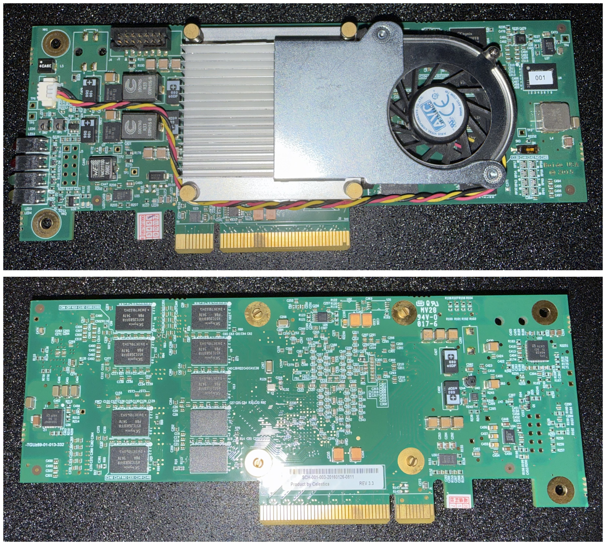

# GMP：一颗跑在 FPGA 上的 NPU，板上生成文字

[English](README.en.md)

本文介绍这份发布包是什么、板上已经做到了什么、包里有哪些东西，读完知道该从哪份文档接着往下走。

**文档模式**：导览。具体操作在 `docs/` 下四份文档里。

## 这是什么

GMP 是一颗自己设计的神经网络加速芯片，综合到一片 Kintex-7（xc7k480t）上，DDR3 里放着
Qwen3 0.6B 的权重。主机把一段话经 JTAG 送进去，芯片自己逐个 token 把整个网络算完，把生成的
文字回传给主机打印出来。

整个网络的算子序列由配套的编译器编好，做成一份程序放进 DRAM，芯片启动后照着跑，主机只负责喂
prompt 与取回结果。RTL 不是直接写的 Verilog，是用 pyrilog（在 Python 里描述硬件，再确定性地生成
Verilog）产出的。

## 板上做到了什么



一趟实跑的最后几行（2026-09-04，完整实录见 [`docs/usage.md`](docs/usage.md)）：

```text
    权重 604.0 MiB 灌完，17.9 分钟
    灌完再抽查 16 处一致
    清零：64 段，共 14.0 MiB，25 s
    CPU 报到，程序版本 1
    逐个喂 18 个：9.3 s
── 生成 ──
我是AI助手，专注于帮助用户解决问题和提供支持。
── 生成 13 个 token（遇到停止 token），decode 平均 0.49 s/步 ──
```

同一段话，与 llama.cpp 用同一份 GGUF 做贪心解码的结果逐字对照（板子刚断电又上电）：

| prompt | 板上生成 | 与 llama.cpp（f32） |
| - | - | - |
| 今天天气不错，我们去（6 token） | 公园散步吧。这句话中，“我们”指的是谁 | 逐字相同（12 个） |
| 请用一句话介绍一下你自己。（对话模板） | 我是AI助手，专注于帮助用户解决问题和提供支持。 | 逐字相同，同样停在结束符 |
| 70 token 的一段话（走 prefill） | 神经网络被引入，使得模型能够处理更复杂的非线性关系，从而在图像和 | 逐字相同（20 个） |

速度：50 MHz 那份 bitstream 上 decode 一步 0.50 秒（2.0 token/s），64 个 token 的 prefill
一轮 1.3 秒；66.7 MHz 那份 2.6 token/s。整份判据（65 轮、73 项逐位比对）在板上全对。

## 包里有什么

| 路径 | 内容 |
| - | - |
| `prebuilt/bit/` | 两份 bitstream：`top_jtag_p3.bit`（50 MHz）与 `top_jtag_c66n.bit`（66.7 MHz） |
| `prebuilt/sim/` | 整机仿真的可执行文件与它装入的两份数据，手上没有板子时用它跑同一套流程 |
| `data/weights.npz` | 定点权重，每个数组的名字就是它在 DRAM 里的地址 |
| `data/load_image.bin` | 启动镜像，板子上电后照着它把程序装进片上 |
| `data/tokenizer.json.gz` | 分词用的词表，从 Qwen3-0.6B 的 GGUF 里摘出来的那几个字段 |
| `host/` | 主机侧全部代码：`soc_generate.py` 入口、`device.py` 读写板子或仿真、`runtime.py` 读权重与逐轮通讯、`hw_params.py` 常量 |
| `tools/pyjtag/` | 纯 Python 的 JTAG 栈，烧录与读写都不需要 Vivado |

这份包里装的是编译好的产物与驱动它们的主机工具，目的是在同型号板子上把上面那些结果复现出来。
RTL 源码、编译器、综合脚本不在包内，所以包里的东西不能用来重新生成 bitstream 或换一个模型。

## 从哪开始

1. [`docs/setup.md`](docs/setup.md)：要哪些硬件、装什么、USB 权限怎么给。
2. [`docs/usage.md`](docs/usage.md)：烧录、灌权重、生成文字的完整流程，每步要多久，出错了先看什么。
3. [`docs/bitstream.md`](docs/bitstream.md)：两份 bitstream 各跑多快、占多少片上资源。
4. [`docs/simulation.md`](docs/simulation.md)：手上没有板子时，同一套流程怎么在仿真上跑。

装好之后一条命令就能对话：

```bash
python host/soc_generate.py --chat "请用一句话介绍一下你自己。"
```

手上没有板子时，同一条命令加 `--sim` 就改在仿真上跑，慢很多，别的都一样。

`demo/` 下是板子的照片。

## 授权

本包按 MIT 授权，见 `LICENSE`。第三方来源的三样东西各自遵循自己的授权：`data/tokenizer.json.gz`
里的词表出自 Qwen3-0.6B（Apache-2.0），`tools/pyjtag/` 里的 `xusb_*.hex` 是 Xilinx 的线缆固件，
随线缆分发，`prebuilt/sim/VSocCosimTop` 里链进了 Verilator 5.020 的运行时库（LGPL-3.0-only
或 Artistic-2.0 双授权）。
