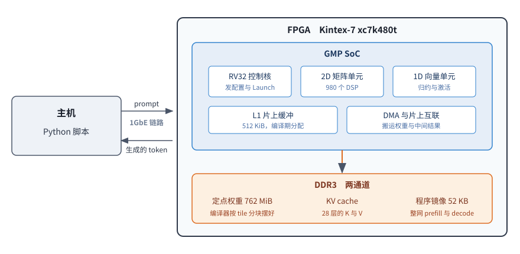

# 用 Agent 做一颗端到端推理芯片

[English](README.en.md)

本包发布一颗端到端推理芯片的编译产物与主机工具。这颗芯片从软件栈到网表的每一层代码均由
AI Agent 实现，人未编写其中任何一行，密集开发一个月，三个仓库共 541 次提交。

本文介绍这颗芯片是什么、板上已经做到了什么、架构如何取舍、开发方式如何组织、配套工具是什么，
以及包内有哪些内容、应当从哪份文档开始。

**文档模式**：项目介绍。具体操作在 `docs/` 下四份文档里。

## 这是什么

GMP 是一颗自研的神经网络加速芯片，综合到一片 Kintex-7（xc7k480t）上，DDR3 里放着
Qwen3 0.6B 的权重。主机把一段话经通讯接口送进去，芯片自己逐个 token 把 28 层算完，中间不用
主机算任何一层，把生成的文字回传给主机打印出来。

整个网络的算子序列由配套的编译器编好，做成一份程序放进 DRAM，芯片启动后照着跑，主机只负责喂
prompt 与取回结果。RTL 主体不是直接编写的 Verilog，而是用 Pyrilog（在 Python 里描述硬件，再确定性地生成
Verilog）产出的。

开发经过的层次包括模型编译器、算子参考实现、按拍计时的 C++ 模型、RTL、综合产出的网表与
bitstream，以及主机侧驱动。



## 板上做到了什么

板上跑一趟的录像：


逐行的终端实录在 [`docs/usage.md`](docs/usage.md)。

同一段话，与 llama.cpp 用同一份 GGUF 做贪心解码的结果逐字对照：

| prompt | 板上生成 | 与 llama.cpp |
| - | - | - |
| 今天天气不错，我们去（6 token） | 公园散步吧。这句话中，"我们"指的是谁 | 逐字相同（12 个） |
| 请用一句话介绍一下你自己。（对话模板） | 我是AI助手，专注于帮助用户解决问题和提供支持。 | 逐字相同，同样停在结束符 |
| 69 token 的一段话（走 prefill + 逐个喂 5 个） | 深度学习模型可以自动学习图像的特征，而不需要人工设计特征。这说明了什么 | 前 17 个逐字相同，第 18 个起分叉 |

速度：80 MHz 上 decode 一步实测 0.088 秒（11.38 token/s）；64 个 token 的 prefill 一轮
51,952,270 拍，0.65 秒。编译器导出的七份判据在板上全部通过，其中整网那一份跑满 65 轮
（1 轮 prefill 加 64 步 decode），logits 与 token 两项与 golden 逐位相同。

布局布线之后的片上资源占用，时序按 80 MHz 的 12.5 ns 周期收敛，布线后最差建立裕量 +0.036 ns：

| 资源 | 用量 | 器件总量 | 占比 |
| - | -: | -: | -: |
| LUT | 212,399 | 298,600 | 71.1% |
| 触发器 | 152,434 | 597,200 | 25.5% |
| BRAM（按 RAMB36 折算） | 789.5 | 955 | 82.7% |
| DSP48 | 1,660 | 1,920 | 86.5% |


图例中的数字是各单元占用的 cell 数。2D 矩阵单元与 1D 向量单元合计过半，外圈的 MIG 是 DDR3
控制器，右上角那一小块是 1GbE 的链路层。

## 架构

这颗芯片只服务端侧推理这一个场景，编译器与硬件按一个整体设计，而不是两侧各自完成后再对接。

**软硬件协同设计**。硬件规格按编译器能够静态确定的需求设定，编译器无法预知的情况，硬件不
另设机制处理。片上缓冲的物理容量与编译器可见容量一致，不存在编译器看不到的部分。每条计算
指令的 latency 对编译器公开，硬件不做动态调度。一处改动在两侧同时落地，同一份判据覆盖两侧。
整个网络的 prefill 与 decode 编译后的程序镜像只有 52 KB。

**全栈自研**。CPU 核、ISA、编译器、微架构与 RTL 均为自研，编写 RTL 的工具与烧录板卡的 JTAG
驱动同样如此。除 FPGA 必需的 DDR3 控制器与时钟原语外，数据通路上没有第三方 IP，任何一层的
修改都不受外部接口与进度制约。

**面向单一场景定制**。按一个模型、一档定点精度定制，不做训练，不做多租户。decode 受限于
DRAM 带宽，架构因此围绕带宽设计，而非堆叠算力。更换模型不需要改动硬件：与模型相关的部分
都在编译器一侧，重新编译出程序与权重写入 DRAM 即可（编译器不随本包发布）。

**规模与性能**。权重按 tile 分块存放，访存按 DRAM 行结构组织，一步 decode 实际读取的容量
从 1,114 MB 降到 662 MB。执行阵列、L1 的 bank 数与 DMA 通道均按需定制，数值结果逐位不变。
1920 个 DSP 使用 980 个，一片 28 nm 的中端 FPGA 即可容纳。

**规格可调**。更换一档规格时，编译器、逐拍模型与 RTL 三侧同步修改，改完重跑判据即可确认
是否引入错误，无需逐处人工复核。控制流已下沉至各引擎，由引擎自行执行预编译的 kernel。

## Agent 做芯片，能做到哪一档

1. 写代码，写 RTL。
2. 完整替代传统 IC 设计的中间一个环节，比如 DV。
3. 按照要求，设计和实现一些独立的功能 / 架构的特性。
4. 根据所有的详细的设计，逐步完成每个环节，最终优化到理想的状态。
5. 端到端针对算法模型设计完整的芯片。

**这个项目落在 3.5**

从一个模块走到一颗端到端推理芯片，差的并不是模型写得更好，差的是每一步
做得对不对，由谁来判断。

## 开发方式

这颗芯片的每一层代码都由 AI Agent 实现，用的是通用模型，没有为编写 Verilog 单独训练过。
Agent 参与的不止是编码：顶层架构定下之后，微架构如何实现、流水线如何切分、算子如何下沉，
都是与它逐轮讨论后确定的，而不是由人给出方案再交由它翻译成代码。人负责定义抽象、设定判据
与在方案之间取舍。

Agent 能否做出一颗端到端推理芯片，取决于工程中有多少判断可以交由机器自动完成，而不取决于
模型编写 Verilog 的能力。硬件开发对 Agent 的困难集中在五点：

* **正确性没有中间档**。一个 bit 出错整颗芯片作废，而 Agent 最擅长产出的正是“看起来对”的
  结果，在这里等同于错。
* **错误暴露晚**。写错一拍要到综合或上板才发现，这一轮反馈以小时计，而 Agent 的修改以秒计。
* **一个设计同时存在六种形式**。算子、微指令、逐拍模型、RTL、网表与 bitstream 之间每转换一次
  都需重新确认语义未变，而形式之间是否一致没有现成的检查手段。
* **设计意图不在代码里**。流水线为何是这个深度，代码中读不出来；Agent 读完整个仓库也无法
  还原当初的取舍。
* **提不出顶层架构**。给定方向之后，Agent 能把它推演到可实现的程度，也能把定下来的架构实现
  到位，但方向本身出不来。整体分成哪几个单元、数据通路是什么形态、抽象在哪一层切开，这些
  判断依赖人的经验。

前四点困难的应对，是把四件事从 Agent 手中移出；第五点没有绕开的办法，顶层架构由人给出。

**判定对错交给可自动执行的判据**。前两点困难都靠把发现错误的时间点提前来化解：编译器输出
与 numpy 参考实现逐位比对；逐拍模型与 RTL 运行同一份产物，比对同一份 golden 数据；上板后以
生成的 token 串与 llama.cpp 逐字对照。判据的数值写入基准文档，每次改动后重新采样并逐项对账。

**翻译交给确定性生成器**。Agent 编写 Pyrilog，Verilog 由生成器产出，模型不介入翻译过程。

**上下文交给分层文档**。设计意图不在代码里，那就让文档成为唯一的权威。全部 244 篇、5.8 万行
文档，每份在开头声明自身模式，分为规则、记录、设计与归档四类；每份是其所属范围的唯一权威，
索引只做索引，不复述结论。跨仓库的不一致逐条编号，处理完成后只保留一行结论，原文移入归档，
编号保持不变。

**表达方式交给固定规范**。如何编写规范、如何使用中文、如何共同拟定提纲，各自写成一份 skill，
每次对话自动加载，不依赖临场提醒，同一处纠正因此不会反复发生。

这套方式的代价同样明确。判据与文档需要持续维护，每 10 行源码配 4 行测试与 4 行文档；编译器
或微架构改动后，七份交付产物需重跑并逐项对账。逐拍模型有时先于 RTL 建成新硬件，此时基准数
描述的是 RTL 完成后的结果，RTL 落地后还需再次对账。设计品位仍然只能由人判断，各层分别最优也不等同于整体最优。

## Agent 在架构、设计与验证上的效果


## 配套工具

两件工具是上述流程的基础，源码不在本包内。

**按拍计时的建模框架**。以 C++ 协程按时间戳推进，整颗芯片的每个单元都在其中建模。跑完整个
网络需要上千万拍，这个框架能够承担，RTL 仿真不能。判据先在模型上跑通，RTL 完成后两者比对
同一份 golden 数据。波形统计以命令行工具输出 JSON，Agent 可直接读取。尚未实现的硬件可以先
在模型中建出来，据此判断是否值得落地。

**Pyrilog**。在 Python 中描述硬件，由确定性生成器翻译成 Verilog。一个类对应一个模块，时序
逻辑写在 cycle 方法中，使用 Python 原生的 if 与 for，时钟与复位自动接入。同样的 Pyrilog 始终
生成同样的 Verilog，两次产物可逐字节比对。3.6 万行 Pyrilog 生成 12.6 万行 Verilog，覆盖 278
个模块；不经生成器、以 Verilog 形式直接存在的只剩 6 千行，是板级封装，以及主机通路上的
第三方以太网 MAC。同一份逻辑的篇幅远小于 Verilog，Agent 读取与生成的开销都随之下降。语言
层面拒绝几类此前会静默通过的写法，例如拼写错误的 `self.x` 过去会成为悬空输入端口，现在直接
报错。

## 包里有什么

| 路径 | 内容 |
| - | - |
| `prebuilt/bit/top_eth.bit` | bitstream，50 / 100 MHz 两个时钟，主机走 1GbE |
| `prebuilt/sim/` | 整机仿真的可执行文件与它装入的两份数据，手上没有板子时用它跑同一套流程 |
| `data/weights.npz` | 定点权重，每个数组的名字就是它在 DRAM 里的地址 |
| `data/load_image.bin` | 启动镜像，板子上电后照着它把程序装进片上 |
| `data/tokenizer.json.gz` | 分词用的词表，从 Qwen3-0.6B 的 GGUF 里摘出来的那几个字段 |
| `host/` | 主机侧全部代码：`soc_generate.py` 入口、`device.py` 读写板子或仿真、`runtime.py` 读权重与逐轮通讯、`hw_params.py` 常量 |
| `host/ethaxi/` | 走网口那条通路的源码：可靠链路与 python 模块，编一次就用 |
| `tools/pyjtag/` | 纯 Python 的 JTAG 栈，烧 bitstream 不需要 Vivado |

这份包里装的是编译好的产物与驱动它们的主机工具，目的是在同型号板子上把上面那些结果复现出来。
RTL 源码、编译器、综合脚本不在包内，所以包里的东西不能用来重新生成 bitstream 或换一个模型。

## 从哪开始

1. [`docs/setup.md`](docs/setup.md)：要哪些硬件、装什么、两处权限怎么给。
2. [`docs/usage.md`](docs/usage.md)：烧录、灌权重、生成文字的完整流程，每步要多久，出错了先看什么。
3. [`docs/bitstream.md`](docs/bitstream.md)：这份 bitstream 跑多快、占多少片上资源。
4. [`docs/simulation.md`](docs/simulation.md)：手上没有板子时，同一套流程怎么在仿真上跑。

装好之后一条命令就能对话：

```bash
python host/soc_generate.py --chat "请用一句话介绍一下你自己。"
```

手上没有板子时，同一条命令加 `--sim` 就改在仿真上跑，慢很多，别的都一样。

`demo/` 下是板子的照片与一段实跑录像。

## 授权

本包按 MIT 授权，见 `LICENSE`。第三方来源的三样东西各自遵循自己的授权：`data/tokenizer.json.gz`
里的词表出自 Qwen3-0.6B（Apache-2.0），`tools/pyjtag/` 里的 `xusb_*.hex` 是 Xilinx 的线缆固件，
随线缆分发，`prebuilt/sim/VSocCosimTop` 里链进了 Verilator 5.020 的运行时库（LGPL-3.0-only
或 Artistic-2.0 双授权）。
