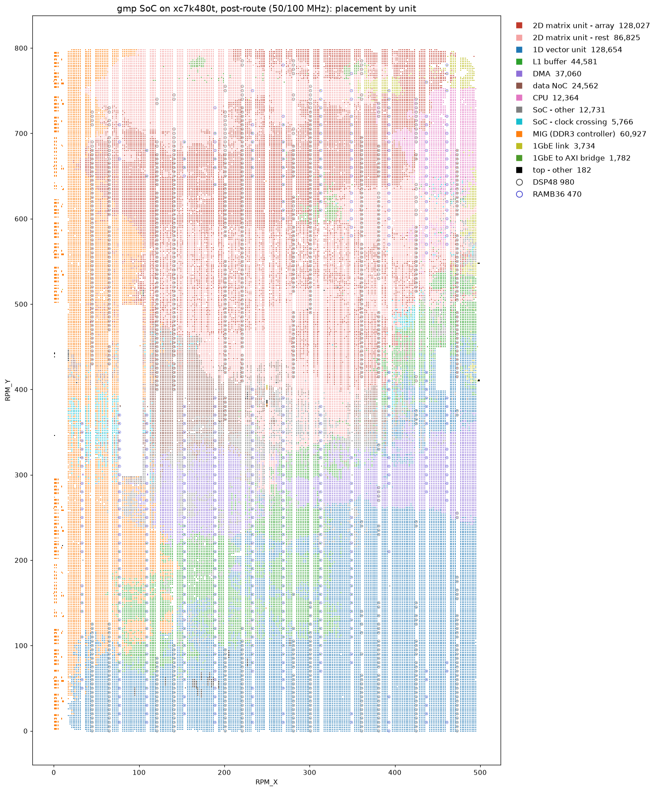

# bitstream 与实测

本文给出发布的这份 bitstream 跑多快、在片上占多少资源，用来判断一次运行的耗时是否合理。

**文档模式**：实测数。

## 时钟

板上的 50 MHz 晶振接进 MMCM，分出 150 MHz 功能时钟，整颗 SoC（包括 2D 阵列）都跑在这一个时钟上。
片上互联与两路 DDR3 之间是异步的，MIG 那两个时钟各约 133 MHz。

综合与布局布线按 150 MHz 的 6.667 ns 周期收敛。布线后功能时钟的最差建立裕量 +0.265 ns、
最差保持裕量 +0.027 ns；全片最差建立裕量 +0.045 ns（在 MIG 里），804,166 个端点全部满足。

## 一轮要多久

拍数由板上 CPU 自己报。decode 一步的秒数是主机实测的墙钟，prefill 一轮的秒数按 150 MHz 折算。

| 一轮 | 拍数 | 秒 |
| - | -: | -: |
| decode 一步（一个 token） | 7,619,122 | 0.052 |
| prefill 一轮（64 个 token） | 53,612,860 | 0.36 |

decode 实测 19.22 token/s。

## 片上资源

器件是 `xc7k480tffg1156-2L`。下表是布线完报的数。

| 资源 | 用量 | 器件总量 | 占比 |
| - | -: | -: | -: |
| LUT | 224,752 | 298,600 | 75.27% |
| 　其中作查找表 | 196,242 | 298,600 | 65.72% |
| 　其中作分布式存储 | 28,510 | 108,600 | 26.25% |
| 触发器 | 211,505 | 597,200 | 35.42% |
| SLICE | 71,276 | 74,650 | 95.48% |
| BRAM（按 RAMB36 折算） | 686 | 955 | 71.83% |
| 　RAMB36 | 677 | 955 | 70.89% |
| 　RAMB18 | 18 | 1,910 | 0.94% |
| DSP48 | 1,555 | 1,920 | 80.99% |
| 引脚 | 242 | 400 | 60.50% |

## 片上布局

这张图出自上一版 bitstream（50 MHz）的布局布线，不是发布的这一份，这一版的图待补。图例里的数字是各单元占用的 cell 数。2D 矩阵
单元与 1D 向量单元合计过半，外圈的 MIG 是 DDR3 控制器，右上角那一小块是 1GbE 的链路层。
